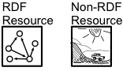

# Descriptif du cours

---


<div class="fragment" data-fragment-index="1">
Ce cours approfondit les bonnes pratiques et outils de préservation 
des données liées (linked data) dans le domaine de l'information documentaire.
</div>
<div class="fragment" data-fragment-index="2">
Thèmes de cette session:

  * Préservation digitale: information package ([OAIS](https://fr.wikipedia.org/wiki/Open_Archival_Information_System))
  * Web sémantique: Linked Data Platform ([LDP](https://en.wikipedia.org/wiki/Linked_Data_Platform))
  * L'exemple de [Fedora Commons](https://duraspace.org/fedora/)
</div>


---

# Open Archival Information System (OAIS)

---


<div class="fragment" data-fragment-index="1">
Préservation numérique = stockage de paquets (AIP).
</div>
<div class="fragment" data-fragment-index="2"> 
Source = données, publications, objets métiers (SIP).
</div>
<div class="fragment" data-fragment-index="3">  
Web sémantique = réseau de triplets décentraclisé.
</div>
<div class="fragment" data-fragment-index="4"> 
Comment concilier ces trois univers?
</div>


---

# Linked Data Platform (LDP)

---

Références concernant cette recommendation du  *World Wide Web Consortium* :

| Document | Description |
|----------|-------------|
| [Primer](https://www.w3.org/TR/ldp-primer/) | Introduction. |
| [Recommendation W3C](https://www.w3.org/TR/ldp/) | Recommendation formelle. |

---

### Ressources

LDP définit deux types de ***ressources*** (ldp:Ressource):

  * RDF
  * non-RDF (i.e. binaires, p.ex. une image, un document PDF, etc.)
  
  
  
--- 

### Containers
    
Les ressources peuvent être organisées dans des ***containers***.

  
 

---

### Hiérarchie de containers
    
Les containers peuvent être organisés hiérarchiquement.

  

---

### Identification

Chaque ressource, chaque container est idientifié par son ... URL. 

---

## Récapitulation

* Les ressources LDP (ldp:Ressource) peuvent être de type RDF ou non-RDF.
* Les ressources peuvent être organisées dans des containers LDP (ldp:Container).
* Les containers peuvent être emboîtés.
* Chaque container/ressource est idientifié par son URL.

---

## Applications

Exemple d'objets pouvant être placés dans des containers LDP:

<div class="fragment" data-fragment-index="1">
* ***Bibliothèque*** [FRBR](https://en.wikipedia.org/wiki/Functional_Requirements_for_Bibliographic_Records)/RDA : Colleciton, Oeuvre, Expression, Manifestation, Item
</div>
<div class="fragment" data-fragment-index="2">
* ***Musées*** [CIDOC-CRM](https://www.cidoc-crm.org/) : Site, Person, Physical object, Physical feature,... 
</div>
<div class="fragment" data-fragment-index="3">
* ***Archives*** [RiC](https://www.ica.org/fr/records-in-contexts-modele-conceptuel)/ISAG(G) : Fonds, Sous-fonds, Séries, Dossiers, Pièces, Instanciations, ...
</div>
<div class="fragment" data-fragment-index="4">
* ***Données de rechreche*** : Collections, Sous-collections, Records, Fichiers, ...
</div>

---


## Rappel Turtle 1/3

| Sujet      | Prédicat        | Objet            |
|------------|-----------------|------------------|
| Mona Lisa  | a pour créateur | Léonard de Vinci |
| <http://www.wikidata.org/entity/Q12418>  | <http://www.wikidata.org/prop/direct/P170>  | <http://www.wikidata.org/entity/Q762> |

En notation Turtle:

```
<http://www.wikidata.org/entity/Q12418> <http://www.wikidata.org/prop/direct/P170> <http://www.wikidata.org/entity/Q762> .
```

---

## Rappel Turtle 2/3

*URLs complets:*

```
<http://www.wikidata.org/entity/Q12418> <http://www.wikidata.org/prop/direct/P170> <http://www.wikidata.org/entity/Q762> .
```

*Notation avec déclaration de préfixes:*

```
PREFIX wd: <http://www.wikidata.org/entity/>
PREFIX wdt: <http://www.wikidata.org/prop/direct/>

wd:Q12418 wdp:P170 wd:Q762.
```

---

## Rappel Turtle 3/3

*Plusieurs triplets*

```
PREFIX wd: <http://www.wikidata.org/entity/>
PREFIX wdt: <http://www.wikidata.org/prop/direct/>
PREFIX dc: <http://purl.org/dc/elements/1.1/> .

wd:Q12418 
            dc:title   "Mona Lisa";
            wdp:P170    wd:Q762, wd:Q123  .
```

---


### Exemple: description archivistique

[Journal du Mont, n°72](https://vaud.archivescommunales.ch/journal-1998-72)


---


---

### Manipulation des ressources/containers

Via HTTP, par les verbes standard:

<div class="fragment" data-fragment-index="1">
  * Accéder : GET
</div>
<div class="fragment" data-fragment-index="2">
  * Créer / Mettre à jour : POST / PUT
</div>
<div class="fragment" data-fragment-index="3">  
  * Supprimer : DELETE
</div>

<div class="fragment" data-fragment-index="3">  
L'usage pratique de LDP sera développé au prochian cours.
</div>

---
