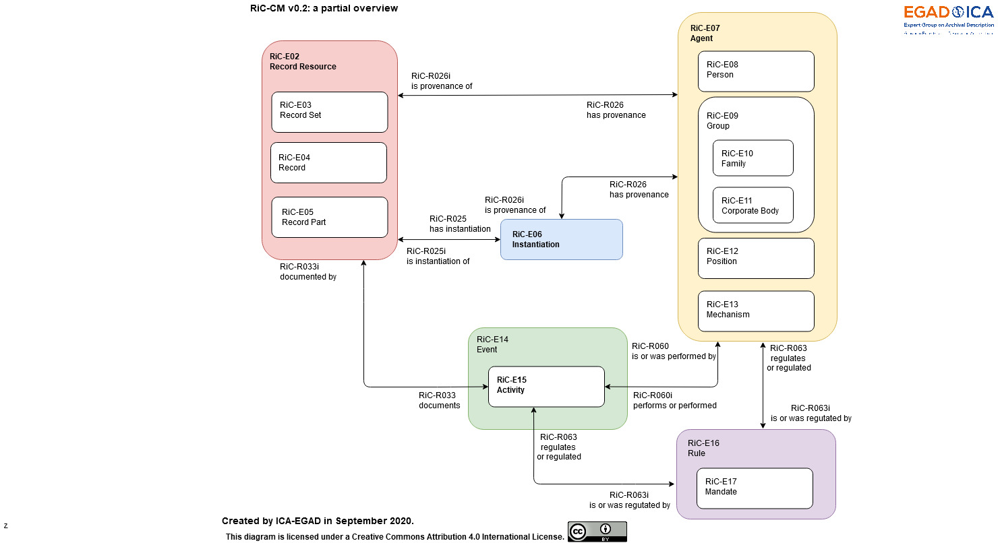
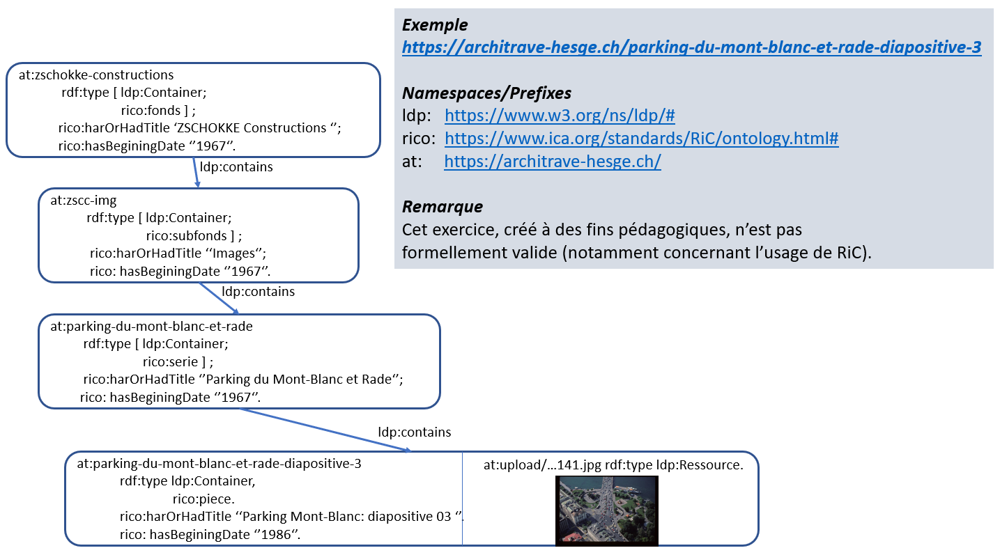
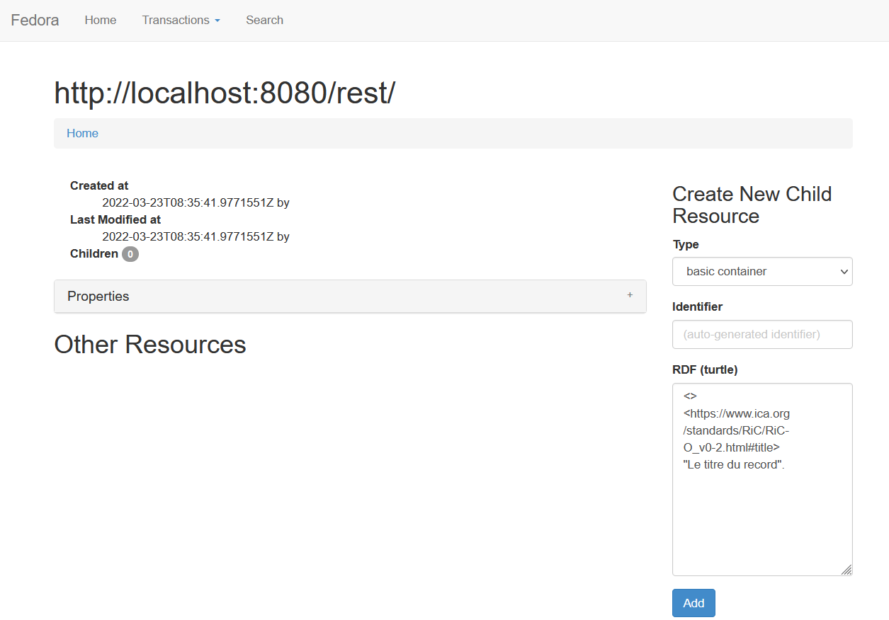
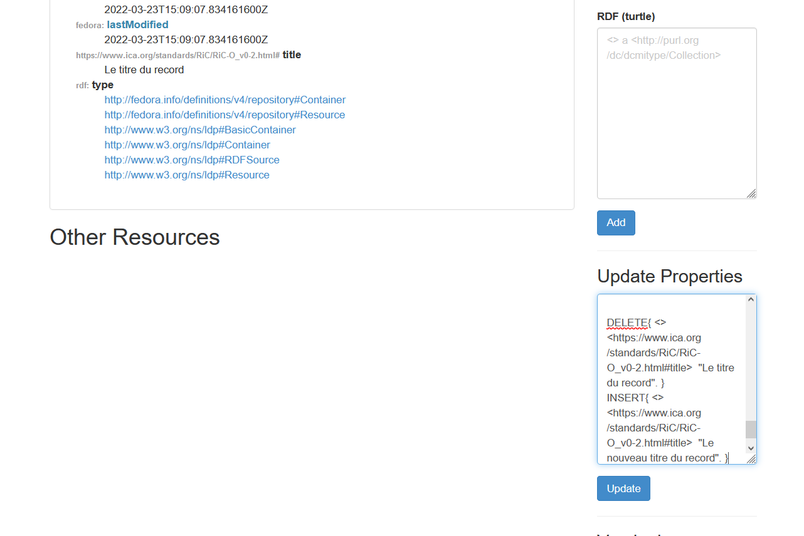

# Thème de cette session

---


  * Plateforme LDP [Fedora Commons](https://duraspace.org/fedora/)
  * Description archivistique [Records in Context](https://www.ica.org/fr/records-in-contexts-modele-conceptuel) et l'ontologie [RiC-O](https://www.ica.org/fr/records-in-contexts-ontology)

---

# Cours précédent

---


* Linked Data Platform (LDP): 
  * Ressources (ldp:Ressource) de type RDF et non-RDF
  * Conteneurs (ldp:Container), peuvent être emboîtés.
  * Manipulation via verbes HTTP (GET, POST, PUT, DELETE).
* Les conteneurs LDP permettent de délimiter les ressources représantant des objets (métier, archivistiques).
* OAIS: objet archivisitque = Archival Information Package (AIP).

---


# Records in Context

---

RiC existe sous deux formes:

* Le modèle conceptuel: RiC-CM
* L'ontologie OWL: RiC-O

RiC-O est l'implémentation technique de RiC-CM, pour l'instant la seule. 

---

* RiC-CM est un modèle entité relation. Tout comme IFLA [LRM](https://www.ifla.org/resources/?oPubId=11412).
* Toute entité est une chose (Thing) et se déciline en différentes classes.
* Les entités sont liées par des relations. 


---



---

RiC-O : [principes](https://www.ica.org/standards/RiC/ontology.html#design-principles)

* Ontologies de référence/domaine de l'archivage
* Utilisable immédiatement
* Flexible (granularité variable)
* Nouveaux potentiels (interprétable/SPARQL, instantiations)
* Extensible (autre contextes que les archives, combinaison)


---

Des concepts complétant RiC-CM [ont été développés](https://www.ica.org/standards/RiC/ontology.html#fromRiCCM-to-RiCO) pour créer RiC-O, p.ex.:

* [rico:Type](https://www.ica.org/standards/RiC/ontology.html#Type) : gestion de types d'entités, utiles pour caractériser les entités et se lier à d'autres ontologies/vocabulaires comme [W3C-SKOS](https://www.w3.org/TR/skos-reference/).
* [rico:Proxy](https://www.ica.org/standards/RiC/ontology.html#Proxy) : intéger un record dans plusieurs record sets (ex: un document élaboré par deux services).
* [rico:Place](https://www.ica.org/standards/RiC/ontology.html#Place) : les lieux peuvent évoluer au cours du temps (ex: frontières qui se déplacent, sur plus de 500 ans dans le cas de la Suisse), voir aussi [linked-places](https://github.com/LinkedPasts/linked-places).

---

Quelques concepts clés de RiC-O (centrés sur les records):

[Url](https://www.ica.org/standards/RiC/ontology#) de l'ontologie. Quelques exemples:

* Titre: [rico:title](https://www.ica.org/standards/RiC/ontology#title)
* Créateur: [rico:hasCreator](https://www.ica.org/standards/RiC/ontology#hasCreator)
* Type: [rico:hasRecordSetType](https://www.ica.org/standards/RiC/ontology#hasRecordSetType)
* Hierarchie: 
    * [rico:hasOrHadPart](https://www.ica.org/standards/RiC/ontology#hasOrHadPart) , [rico:isOrWasPartOf](https://www.ica.org/standards/RiC/ontology#isOrWasPartOf)
	* [rico:includesOrIncluded](https://www.ica.org/standards/RiC/ontology#includesOrIncluded) , [rico:isOrWasIncludedIn](https://www.ica.org/standards/RiC/ontology#isOrWasIncludedIn) 
* État: [rico:hasRecordState](https://www.ica.org/standards/RiC/ontology#hasRecordState)
* Date: [rico:hasBeginningDate](https://www.ica.org/standards/RiC/ontology#hasBeginningDate) , [rico:hasEndDate](https://www.ica.org/standards/RiC/ontology#hasEndDate) 

---

# Correctif exercice TP




---

# Gesion des containers via l'interface web

---

# Créer un container (interface Web) 



---

Dans la boite de dialogue "RDF Turtle", insérer:

```
<>   
<https://www.ica.org/standards/RiC/ontology#title>   
"Le titre du record".
```

Cliquer ensuite sur le bouton "Add" comme dans la capture d'écran ci-avant.

A noter que le container est créé comme enfant du container courrant.

---

# Modifier un container (Web) 



---

Dans la boite de dialogue "Update Properties", remplacer:

```
DELETE { }
INSERT { }
```

Par

```
DELETE{ <> <https://www.ica.org/standards/RiC/ontology#title>  "Le titre du record". }
INSERT{ <> <https://www.ica.org/standards/RiC/ontology#title>  "Le nouveau titre du record". }
```

Puis cliquer sur le bouton "Update".

Cf. capture d'écran ci-avant.

---

# Créer une ressouce binaire


---

Dans la section "Create New Child Ressource", choisir "Type" : "binary" dans la liste déroulante comme dans la capture d'écran précédente.

Puis cliquer sur "Parcourir" (ou "Browse") pour sélectionner le fichier à envoyer dans Fedora.

Valider en cliquant sur le bouton "Add".


---

# Gestion des containers par HTTP

---


Les verbes standard standard sont utilisés ([API rest](https://fr.wikipedia.org/wiki/Representational_state_transfer)):

<div class="fragment" data-fragment-index="1">
  * Accéder : GET
</div>
<div class="fragment" data-fragment-index="2">
  * Créer / Mettre à jour : POST / PUT
</div>
<div class="fragment" data-fragment-index="3">  
  * Supprimer : DELETE
</div>

---

## Rappel: python

Dans le contexte de la HEG, python est installé sur les postes via l'outil Anaconda.

Pour l'exécutér, ouvrir:

```
Windows > Menu démarrer > Anaconda prompt
```

Puis tapper:

```
python
```
et enter.


---

## Python sur ordinateur personnel

Dans le cadre d'une installation classique de Python 3 ([téléchargement](https://www.python.org/downloads/)), installer le paquet "requests" si ce n'est pas déjà fait:

***Sous Linux:***

```
pip3 install requests
```


ou 

```
pip install requests
```


***Sous Windows:***


```
python -m pip install requests
```


***Sous MacOS:***

```
sudo easy_install pip
sudo pip install --upgrade pip 

```

---


# Accéder à une ressource

```
import requests
url = 'http://localhost:8080/rest/record/9a3f45'
r = requests.get(url)
print('Status code:', r.status_code)
print(r.text)

```


---

# Créer un container

```
import requests
url = 'http://localhost:8080/rest/record/monDossier'
headers = {"Content-Type": "text/turtle"}
auth = ('fedoraAdmin', 'fedoraAdmin')
data = """ <>  <rico:title> 'Ceci est le titre'.
		   <>  <rico:scopeAndContent>   'Voilà la description'.
		   """
r = requests.put(url, auth=auth, data=data.encode('utf-8'), headers=headers)
print( 'Status:', r.status_code )
print( r.text )
```

---


# Mettre à jour un container

```
import requests
url = 'http://localhost:8080/rest/record/monDossier'
headers = {"Content-Type": "text/turtle"}
auth = ('fedoraAdmin', 'fedoraAdmin')
data = """ <>  <rico:title> 'Ceci est le titre mis-à-jour.'.
		   <>  <rico:scopeAndContent>   'Et la description revue'.
		   """
r = requests.put(url, auth=auth, data=data.encode('utf-8'), headers=headers)
print( 'Status:', r.status_code )
print( r.text )
```

Voir les section Versionning : "View Versions"

---


# Créer une ressource binaire

Le code suivant suppose qu'une ressouce binaire nomée "image.jpg" se
trouve dans le répertoire depuis lequel vous lancez votre script Python.

---


```
import requests
import os
filename = 'image.jpg'
mimetype = 'image/jpeg'
data = open(filename,'rb').read()
url = 'http://localhost:8080/rest/records/monDossier/binary'
auth = ('fedoraAdmin', 'fedoraAdmin')
headers = { "Content-Type": mimetype,
			"Link" :"<http://www.w3.org/ns/ldp#NonRDFSource>; rel=type"}
r = requests.put(url, auth=auth, data=data, headers=headers)
print( 'Status:', r.status_code )
print( r.text )
```

---

# Versionning RFC 7089 (Memento)

---

[Memento](https://datatracker.ietf.org/doc/html/rfc7089) est le protocol de navigation temporel du Web.

* Par défaut, Fedora Commons conserve toutes les versions des ressources. 
* Il est possible de personnaliser ce fonctionnement.
* Cela perment de naviguer dans le temps (p.ex. mise à jour du plan de classement).

Voir aussi: 
*[Memento at W3C](https://www.w3.org/blog/2016/08/memento-at-the-w3c/)
*[Timetravel](https://timetravel.mementoweb.org/), avec [cet exemple](http://timetravel.mementoweb.org/list/20100210065733/http://admin.ch) et [celui-ci](http://dbpedia.mementodepot.org/memento/20161015000000/http://dbpedia.org/page/Ukraine).

---
