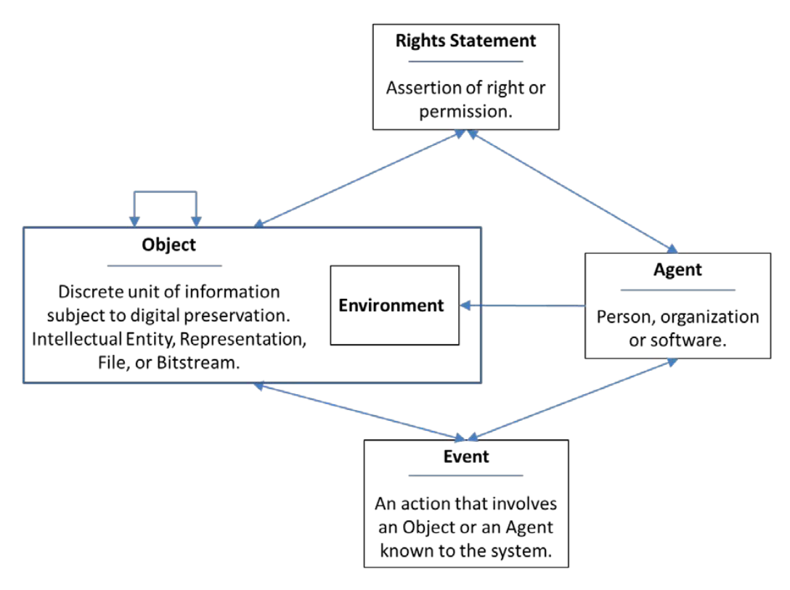

# Thème de cette session

---

  * Ontologie de préservation ([PREMIS](https://fr.wikipedia.org/wiki/Preservation_Metadata:_Implementation_Strategies))
  * Schémas de grahes RDF ([SHACL](https://fr.wikipedia.org/wiki/SHACL))

---

# Cours précédents

---

* Linked Data Platform (LDP): 
  * Ressources (ldp:Ressource) de type RDF et non-RDF
  * Conteneurs (ldp:Container), peuvent être emboîtés.
  * Manipulation via verbes HTTP:
    * GET: lire
	* POST / PUT : créer / mettre à jour
	* DELETE : effacer
* Les conteneurs LDP permettent de délimiter les ressources représantant des objets (métier, archivistiques).
  * Combinaison d'ontologies, p.ex. RiC-O, SKOS et autres
  * Fedora Commons accepte tout turtle valide (ressources RDF)

  
---

# PREMIS

---

PREservation Metadata : Implementation Strategies (PREMIS) permet de représenter:

* les objets (p.ex. records),
* les événements (de préservation),
* les agents (personnes, logiciels) impliqués dans ces événement,
* les droits.

en RDF.


---



---

Une représentation fine des objets numériques est disponible. 

---


---

Exemple / demonstration : [docuteam Packer](https://wiki.docuteam.ch/doku.php?id=docuteam:packer) (logiciel libre)


---

Exemples de concepts PREMIS:

* premis:hasMessageDigest (checksum)
* premis:signature (signature numérique)
* premis:hasSize (taille en octets) 
* premis:orginalName (nom original)
* premis:rights (droits)
* premis:formatRegistry (format de fichier)
* premis:creatingApplication (application)
* premis:environmentDesignatinon (système)
* premis:inhibitors (inhibiteurs t.q. DRM ou chiffrement, cf. [DLCM](https://sandbox.dlcm.ch/administration/docs/DLCM-IntegrationGuide.html))
* premis:hasCompositionLevel (composition)

---


PREMIS peut être combiné aux ontologies descriptives pour assurer la préservation numérique. Par exemple:

| PREMIS | RiC-O |
|--------|-------|
| - | RecordSet RiC-E03 |
| Intellectual entity | Record RiC-E04 |
| Representation | Instantiation RiC-E06 |
| File | - |
| Datastream | - |

---

Mais comment faire en pratique?

---

# SHACL (Core)

---

[SHape and Constraint Language](https://www.w3.org/TR/shacl/) (W3C)

* Il s'agit d'un langage de validation de graphe RDF.
* Les graphes sont compsés de noeuds (ensembles de triplets).
* Validation porte sur la structure et le contenu des noeuds.

Exemple:

---

```turtle
ex:Alice
	a ex:Person ;
	ex:ssn "987-65-432A" .

ex:Bob
	a ex:Person ;
	ex:ssn "987-65-432B" ;
	ex:birthDate "1971-07-07"^^xsd:date ;
```

SHACL

```turtle
ex:PersonShape
	a sh:NodeShape ;
	sh:targetClass ex:Person ;    # toutes les pesonnes
	sh:property [                 # _:b1
		sh:path ex:ssn ;          # contraintes ex:ssn
		sh:maxCount 1 ;
		sh:minCount 1 ;
		sh:datatype xsd:string ;
	] ;
	sh:property [                 # _:b2
		sh:path ex:birthDate ;
		sh:maxCount 1 ;
		sh:datatype xsd:date ;
	] ;
```

---

### Nous allons nous focaliser sur

* Nombre d'occurences:  
  * ***sh:minCount*** , ***sh:maxCount***
* Type de noeud: 
  * ***sh:NodeKind sh:IRI*** , ***sh:NodeKind sh:BlankNode***
* Type de donnés: 
  * ***sh:datatype xsd:date***, ***sh:datatype xsd:string*** 
* Format
  * ***sh:maxlength 50***
  * ***sh:pattern "^\\d{3}\\.\\d{4}\\.\\d{4}\\.\\d{2}$"***
 

---

### Mode de validation fermé

Pour un noeud donné, le mode fermé (***sh:closed true***), requiert que
chaque triplet satisfasse au moins une condition énoncée.

Par défaut, le mode est ouvert. En d'autre termes, les triplets non concernés
pas les conditions sont ignorés.

---

## Démonstration

---

Validateurs en ligne: 

* [SHACL Play](https://shacl-play.sparna.fr/play/validate)
* [SHACL.js](https://www.ida.liu.se/~robke04/SHACLTutorial/)

Ou avec un module python (fournit avec le TP3).

Syntaxe pour valider le RDF *dossier.ttl* en utilisant le SHACL shacl.ttl:

```
python shacl.py dossier.ttl shacl.ttl
```


---