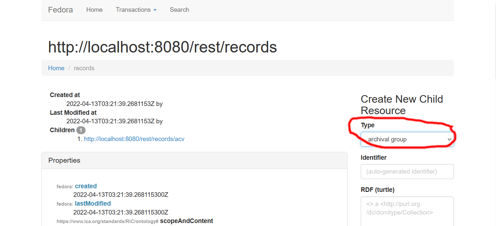

# Thème de cette session

---

* Archival Informatin Pacakges (AIP) : paquets d'information archivistiques.
* Oxfrod Common File Layout (OCFL) : une spécification pour les paquets d'information.

---

# Sessions précédentes

---

* Linked Data Platform (LDP): 
  * Ressources (ldp:Ressource) de type RDF et non-RDF
  * Conteneurs (ldp:Container), peuvent être emboîtés
* Les conteneurs LDP permettent de délimiter les ressources représantant des objets
  * Combinaison d'ontologies, p.ex. RiC-O, PREMIS, SKOS.
* PREMIS permet de modéliser et organiser la préservation
* SHACL permet de définir des "shapes"
  * comment les ontologies sont utiliées et combiniées
  * de valider la conformité a la définition

---

## Cette session

* Archival Informatin Pacakges (AIP) : paquets d'information archivistiques.
* Oxfrod Common File Layout (OCFL) : une spécification pour les paquets d'information.

---

# AIPs

---

Rappel - schéma d'un système de préservation OAIS :


---

* Les AIPs sont autonomes : ils contiennent toutes les données et métadonnées d'une "unité archivistique".
* Au coeur du module de stockage OAIS, ils sont structurés de façon à ce que celui-ci puisse remplir ses foncions. 

---


---

### Cardinalité ContainerLDP - AIP 

---

Cette cardinalité peut être de m - n.

* un objet (container LDP) peut être archivé dans m AIP
* un AIP peut peut archiver n objets (containers LDP)

---

Dans Fedora Commons

* Par défaut, chaque container LDP est stoqué comme un seul AIP.
* Il est possible d'attibuer la propriété "archival unit" a un container LDP.
* Ceci a pour effet que ce container et tout ses enfants (définis par *ldp:contains*) sont "physiquement" stoqués dans le même AIP.

---

## Créer un archival unit dans l'interface de Fedora



---

## Créer un  "archival unit" via l'API

```
import requests
url = 'http://localhost:8080/rest/records/acv/D9999'
headers = {"Content-Type": "text/turtle",
           "Link": '<http://fedora.info/definitions/v4/repository#ArchivalGroup>;rel="type"'}
auth = ('fedoraAdmin', 'fedoraAdmin')
data = """ <>  <rico:title>            'Ceci est le titre'.
		   <>  <rico:scopeAndContent>  'Voilà la description'.
		   """
r = requests.put(url, auth=auth, data=data.encode('utf-8'), headers=headers)
print( 'Status:', r.status_code )
print( r.text )
```

---

# OCFL

---

[Oxford Common File Layout](https://ocfl.io/) est une sécificiation. Selon [ocfl.io](https://ocfl.io/) :

> This Oxford Common File Layout (OCFL) specification 
> describes an application-independent approach to the storage of digital information
> in a structured, transparent, and predictable manner. 
> It is designed to promote long-term object management best practices within digital repositories.

---

Toujours selon [ocfl.io](https://ocfl.io/), ses bénéfices :

* ***Completeness***, so that a repository can be rebuilt from the files it stores
* ***Parsability***, both by humans and machines, to ensure content can be understood in the absence of original software
* ***Robustness*** against errors, corruption, and migration between storage technologies
* ***Versioning***, so repositories can make changes to objects allowing their history to persist
* ***Storage diversity***, to ensure content can be stored on diverse storage infrastructures including conventional filesystems and cloud object stores

---

En pratique, OCFL définit:

* la hiérarchie de stockage
  * i.e. l'organisation de paquets sur le media
* le format des paquets d'information
  * i.e. la structure des paquets eux-mêmes

---

## La hiérachie de stockage OCFL

Elle doit être déterministe. Dans le cas de Fedora Commons, la règle oar défaut pour calculer le chemin des paquets est la suivante:

```
hash := sha256( fedoraId )
chemin := hash[0:3]/hash[3:6]/hash[6:9]/hash
```

Exemple:

```
fedoraId = records/acv/dossiers/D1
chemin = 536/2a8/fe0/5362a8fe0af7fd17596d076f943f179...
```

---

## La structuctue des paquets OCFL

* un répertoire par version v1, v2, v3, ...
* dans chaque répertoire de version, il y a:
  * un fichier manifeste, *manifest.json*, comprenant: 
    * listing des fichiers (avec leur chemin) composant la version courrante (ainsi que pour les versions antérieures)
	* le checksum correspondant à chaque fichier
	* au début du manifeste, le checksum permet de localiser tout fichier, même si il stoqué dans une version précédent
  * un répertoire "content* fichiers ajoutés ou modifiés dans la version courrante

---

Exemple:


---

Démo : exemple d'un dossier dans Fedora Commons.

---


