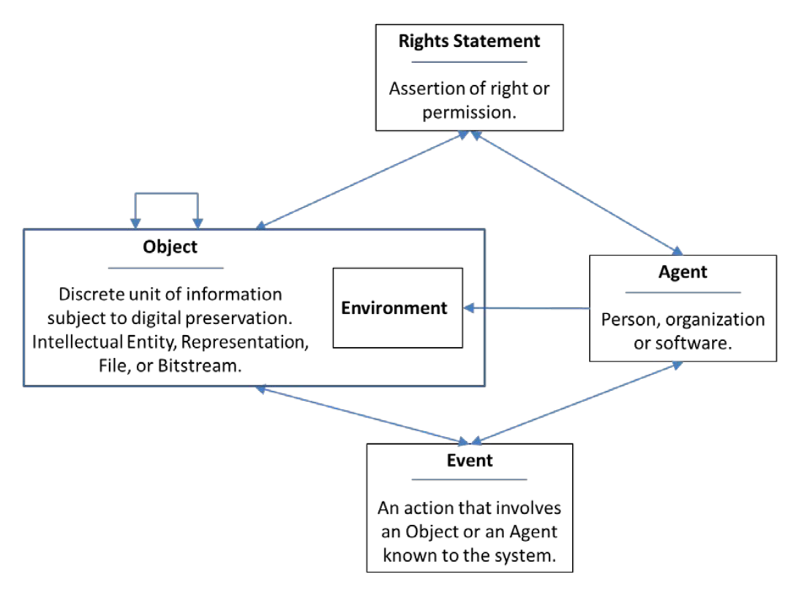
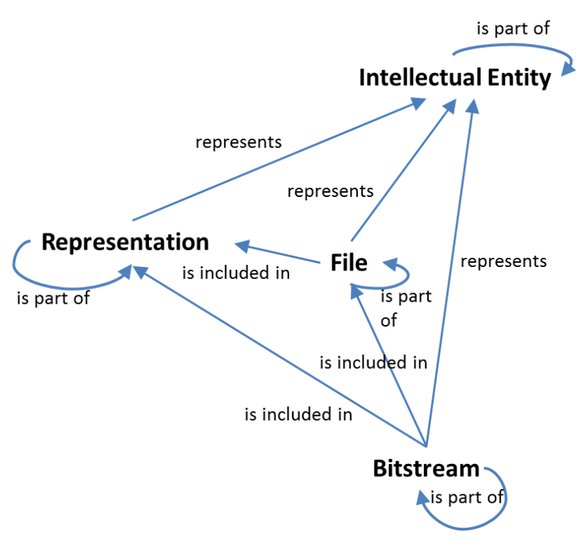

# Récapituation et intégration


---

### Thématiques couvertes dans ce cours

Modélisation de: 

1. la description d'objets (Ontologie RiC)
2. la préservation d'objets (Ontologie PREMIS)
3. l'association d'ontologies et contraintes aditonnelles, avec validation formelle (SHACL)
4. l'empaquetage de ressources RDF et binaires et de leur versionnage (containers LDP, Fedora Commons)
5. la préservation des containers LDP versionnés dans des AIP au sens la norme OAIS (OCFL,Fedora Commons)
6. valorisation d'objets préservés (cours suivant)

---

### 1. Description Ontologie RiC

* Record ressources : collections, fonds, séries, dossiers, documents
* Instanciations : item ou article à proporent dit (fichiers, objets physiques)
* Événements : création, clôtrue, etc.
* Lieux : géographie
* Dates : ponctuelles, liste ou plages
* Agents : groupes, presonnes morales ou physiques, agents logiciels

*** => ontologie du domaine des archives ***
 
---


---

**Exemple:**

```
ex:record371			a						rico:Record ;
						rico:title				'Photo du Cervin' ; 
						rico:hasInstantiation	ex:instantiation472 .
ex:instantiation472		a						rico:Instantiation ;
						rico:name				'20220525_123458.jpg' .
```
---


### 2. Métadonnées de préservation (PREMIS)

---




---



---

PREMIS peut être combiné à RiC-O:

| PREMIS | RiC-O |
|--------|-------|
| - | RecordSet RiC-E03 |
| Intellectual entity | Record RiC-E04 |
| Representation | Instantiation RiC-E06 |
| File | - |
| Datastream | - |

---

```
ex:instantiation472		a						rico:Instantiation ;
						a						premis:Representation;
						rico:title				'Captured with Fariphone 4' ;
						premis:includes			ex:file9642 .
ex:file9642				a						premis:File ;
						premis:originalName     '20220525_123458.jpg' ;
						premis:messageDigest    '16a993c472d589f7bc36922...';
						premis:messageDigestAlgorithm   'SHA512';
						premis:size             1023 ;
						premis:formatRegistyKey 'fmt/432' ;
						premis:formatRegistryName 'PRONOM' .
```

### 3. Association d'ontologies et contraintnes (SHACL)
 

* définition de l'articulation des ontologies (ex. combinaison RiC et PREMIS)
* contraintes personaliées à souhait (ex. minimum un agent-auteur avec numéro AVS valide)
* validation fermée ou ouverte à choix (permet de la souplesse... ou pas)
* permet d'étendre à volonté l'ontologie descriptive (ex. RiC+SKOS+EbuCore ou DublinCore+SKOS+RDAU)

***=> respect d'un schéma rigoureux, fondamental pour la préservation***

---

### Extension de la description

Autes ontologies descriptives à ne pas rater:

* [DublinCore](https://www.dublincore.org) : [Element Set](https://www.dublincore.org/specifications/dublin-core/dces/) et [DCMI Terms](https://www.dublincore.org/specifications/dublin-core/dcmi-terms/)
* [RDA-U](http://www.rdaregistry.info/Elements/u/) : Research Data Alliance - nombreuses propriétés concernant les records et agents
* [EBU-core](https://tech.ebu.ch/publications/tech3293) : Eurovision data model - multimedia
* [IFLA-LRM](https://repository.ifla.org/handle/123456789/40) : Library Reference Model - nouvelle évolution après FRBR
* [CIDOC-CRM](https://www.cidoc-crm.org/) : Musées

---

```turtle
ex:InstantiationShape
	a sh:NodeShape ;
	sh:targetClass rico:Instantiation ;
	sh:property [
		sh:path rdfs:type ;
		sh:class premis:Representation ;
	] ;
	sh:property [                
		sh:path premis:includes ;         
		sh:minCount 1 ;
		sh:NodeKind sh:IRI ;
	] .
```

---


### 4. Empaquetage des ressources RDF et binaires (LDP)

* Containers LDP permettent de conditionner les ressources de façon à ce qu'elles coresspondent aux objets à archiver (dossiers, documents, etc.).
* Gestion des versions des objets (RFC 7089, Memento)
* Normalisation de la manipulation des containers (création, modification, etc.)

***=> Adéquation avec les objets métier à archiver et interopérabilité***

---

LDP BasicContainer:
```
ex:record371			a						rico:Record ;
						rico:title				'Photo du Cervin' ; 
						rico:hasInstantiation	ex:instantiation472 ;
						ldp:contains			ex:instantiation472 .
```	
					
LDP BasicContainer:
```						
ex:instantiation472		a						rico:Instantiation ;
						a						premis:Representation;
						premis:includes			ex:file9642 .
...
```

---

### 5. Préservation (OAIS, OCFL)

Chaque objet OCFL peut préserver un ou plusieur container LDP. OCFL a cinq objectifs principaux:
* Complétude (disater recovery)
* Parsabilité (humains et machines)
* Robustesse (erreur, corruption, migrtions)
* Versionnage (hisorique des objets)
* Diversité de stockage (multi-infrastructure et migrations)

---

## Créer un  "archival unit" via l'API

```
import requests
url = 'http://localhost:8080/rest/records/acv/D9999'
headers = {"Content-Type": "text/turtle",
           "Link": '<http://fedora.info/definitions/v4/repository#ArchivalGroup>;rel="type"'}
auth = ('fedoraAdmin', 'fedoraAdmin')
data = """ <>  <rico:title>            'Ceci est le titre'.
		   <>  <rico:scopeAndContent>  'Voilà la description'.
		   """
r = requests.put(url, auth=auth, data=data.encode('utf-8'), headers=headers)
print( 'Status:', r.status_code )
print( r.text )
```

Noter la partie "link" dans les headers.

---

# Intégration

---

[Animation d'intégration](./media/integration.pptx)

---

# Discussion

---

La combinaision de ces standards et outils permet:

1. Généraliser la description / catalogage
2. Préservation à long terme des objets
3. Une excellente interopérabilité (cf. cours suivant)


---

### 1. Généralisation de la description

* Richesse des ontologies "métier": [LOD cloud](https://lod-cloud.net/)
* Interconnexions (owl:sameAs) entre les ontologies
* Les contraites d'accès pour les usagers tombent (ISAD(G): accès selon la structure arborescente des fonds imposée)


---

***Focus sur la structure***

P.ex. RiC, et les technologies du Web sémantique en général, offre un accès multi-dimentionnel (pas seuleuement selon un arbre):

* Les "records sets" ne sont plus limités a une structure aborscente bi-dimentionnelle.
* D'abord, l'arbre peut changer dans le temps => structure tri-dimentionnelle (demo dans Fedora).
* Plusieurs regroupements intellectuels peuvent être faits et combinés (rico:proxy), exemple de [BodmerLab](https://bodmerlab.unige.ch/fr) et d'[Europeana/Histoires](https://www.europeana.eu/fr/stories) et .
* L'accès par d'autre types d'objets (agents, sujets, lieux, fonctions, etc.) est facilité.

---

### 2.1. Préservation : Périmètre des objets

---

* Les containers LDP permettent de regrouper le RDF relatif aux objets à préserver (dossiers, documents ou autre).
* OCFL permet de gérer les diverese verions des objets à préserver dans les AIP de façon faible et portable (voir de plus les 5 objectifs).
* Le concept d'*unité archivistique* (*archival unit*) permet de regrouper les objets qui vont ensemble (p. ex. un dossier et ses documents).

---

### 2.1. Préservation : Format universe

Le RDF, basé sur le concept sujet-objet-prédicat:

* structure universelle et de ce fait épargnée par l'obsolescence technologique
* très utilisée, dans de nombreux dommaines (informatique, biologie, etc.)

---

### 3. Interopérabilité

---

Est très élevée, par nature même de la technologie choisie le but premier du Web sémantique.

Ceci sera développé dans la prochaine et dernière session de ce cours.

---

# Questions / réponses

---

