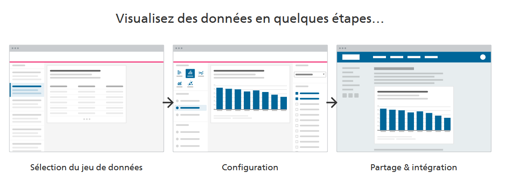
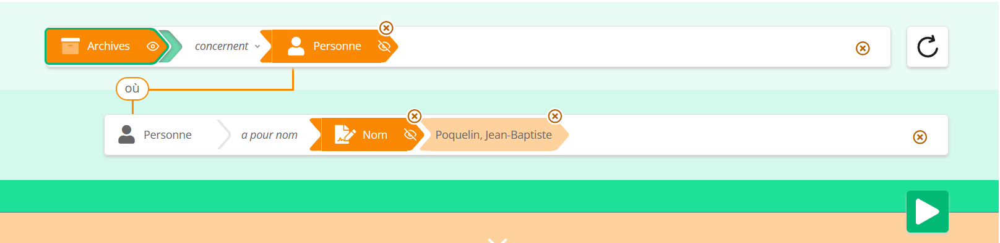
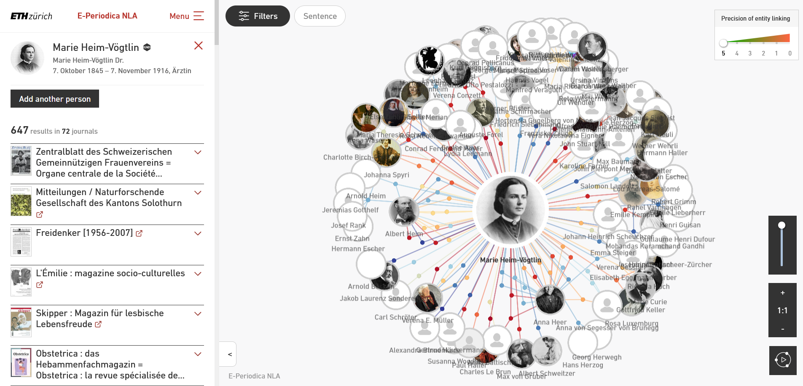
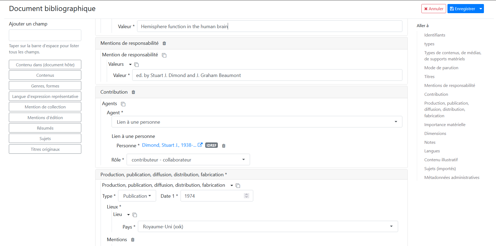

# Valoraisation

---

On peut lire dans le premier paragraphe de la norme [OAIS](https://public.ccsds.org/pubs/650x0m2.pdf):

> An OAIS is an Archive, consisting of an or ganization, 
> which may be part of a larger organization, of people 
> and systems that has accepted the responsibility to preserve
> information and ***make it available for a Designated Community***. 

***=> Pas de préservation sans diffusion !***

---

### Rappel - Schéma OAIS :


---

### Rappel - Intégration

[Animation d'intégration](./media/integration.pptx)

---

### AAS Ensemen

Groupe de travail de l'association des archivstes suisse: [ENSEMEN](https://vsa-aas.ch/verein/arbeitsgruppen/ensemen/)

cf. les documents porduits.

---


### Memoriav

**Mission** :  Memoriav s’engage activement et durablement pour la sauvegarde, la mise en valeur et l’utilisation à grande échelle
du patrimoine audiovisuel sur tout le territoire de la Suisse. Memobase est la plateforme de Memoriav, il s'agit d'un aggrégateur national des ressources multi-media. 

* Web: [memobase.ch](http://memobase.ch)
* API: [api.memobase.ch](http://api.memobase.ch)
* Code open source: [Memobase 2020](https://gitlab.switch.ch/memoriav/memobase-2020)
* Documentation: [Modèle de données basé sur RiC-O](https://ub-basel.atlassian.net/wiki/spaces/MD/pages/331939971/Datenmodell)

  
---

### Archives PTT (Poste Télégrammes Téléphones)

Le musée de la communication est une fondation financée par La Poste et Swisscom, qui, partagent des archives communes.

La fondation a choisi RiC-O comme schéma de base pour sa salle de lecture virtuelle (prototype) qui regroupe les collections muséales (MuseumPlus), 
de bibliothèque (Swisscovery) et d'archives (ScopeArchiv)

---
  
### Archives du Canton de Bâle-Ville

* [SPARQL](https://ld.staatsarchiv.bs.ch/sparql/) 
* Mise-à-jour quotidienne depuis ScopeArchiv:
  * [Pipeline - open source code](https://github.com/Staatsarchiv-Basel-Stadt/RDF-Pipeline)
  * [Mappings - open source code](https://github.com/Staatsarchiv-Basel-Stadt/StABS-scope2RDF)
  * [Stardog triple store docker - open source code](https://github.com/Staatsarchiv-Basel-Stadt/stardog-docker)
 
Le pipeline scopeArchiv peut être intérassant comme phase de transition.
 
---

Démo https://ld.staatsarchiv.bs.ch/sparql/ 

```
PREFIX rico: <https://www.ica.org/standards/RiC/ontology#>
PREFIX rdf: <http://www.w3.org/1999/02/22-rdf-syntax-ns#>
PREFIX rdfs: <http://www.w3.org/2000/01/rdf-schema#>
SELECT * WHERE {
  ?sub rico:title ?title .
  ?sub rico:isAssociatedWithDate ?date .
  ?date rico:expressedDate ?eDate .
  FILTER regex(?title, ".*[Pp]artei.*", "i").
  FILTER regex(?eDate, ".*1[45]\\d\\d.*", "i").
} 
LIMIT 100
```

---

***Liste des prédicats RiC-O utilisés***

```
PREFIX rico: <https://www.ica.org/standards/RiC/ontology#>
PREFIX rdf: <http://www.w3.org/1999/02/22-rdf-syntax-ns#>
PREFIX rdfs: <http://www.w3.org/2000/01/rdf-schema#>
SELECT DISTINCT ?pred WHERE {
  ?sub ?pred ?obj .
  FILTER(regex(str(?pred), "RiC" ) )
} 
LIMIT 100
```

---

### Archives fédérales - SPARQL

https://lindas.admin.ch/

```
PREFIX ac: <http://umbel.org/umbel/ac/>
PREFIX schema: <http://schema.org/>
PREFIX rdf: <http://www.w3.org/1999/02/22-rdf-syntax-ns#>
PREFIX rdfs: <http://www.w3.org/2000/01/rdf-schema#>
PREFIX rico: <https://www.ica.org/standards/RiC/ontology#>
PREFIX adm: <https://schema.ld.admin.ch/>
PREFIX ais: <https://culture.ld.admin.ch/ais/>

SELECT DISTINCT * WHERE {
    ?record rico:isOrWasIncludedIn* ais:7618405 . 
    ?record rico:isOrWasIncludedIn ?parent .
    ?record rico:identifier ?id .
    ?record rico:title ?title .
    OPTIONAL { ?record rico:isAssociatedWithDate/rico:beginningDate ?beginningDate . }
    OPTIONAL { ?record rico:isAssociatedWithDate/rico:beginningDate ?endDate . }
    OPTIONAL { ?record adm:referenceCode ?referenceCode . }
}
LIMIT 100
```

---

### Archives fédérales - Visualisation

[visualize.admin.ch](https://visualize.admin.ch/)



---

### Démonstrateur des Archives nationales de France

[SPARNATURAL - démonstrateur A](https://sparna-git.github.io/sparnatural-demonstrateur-an/index-A.html)




---

### Graphes - Next Level Access

[exploration de graphes](https://nla.e-periodica.ch/gnd-118977962)



---

### Edition de données sémantiques

[Invenio ILS](https://invenio-software.org/), exemple d'édition sur [RERO ILS](https://ils.test.rero.ch/professional/records/documents/detail/791).



---


### docuteam : système d'archivage RiC


* [outils](https://www.docuteam.ch/fr/software-fur-archive/)
* [documentation](https://docs.docuteam.ch/fr/)
  
---

### En France

* Prototype PIAAF (France)
  * https://piaaf.demo.logilab.fr/sparql
  * https://piaaf.demo.logilab.fr/editorial/help
  
[Autres exemples](https://ica-egad.github.io/RiC-O/projects-and-tools.html).

---

### SWITCH Connectome

> Connecting open research data (ORD) to make it accessible, 
> interoperable and valuable for research, education and innovation.

[Connectome](https://www.switch.ch/connectome/)

---


### Conversion EAD et EAC en RiC

* EAD et EAC [RiC-O converter](https://github.com/ArchivesNationalesFR/rico-converter)

---

### Outils divers

* Conversion en RDF: [RDF Mapping Language](https://rml.io/specs/rml/)
* Triples stores performants: [Large Triple Stores](https://www.w3.org/wiki/LargeTripleStores)
* Graph databases : p.ex. [neo4j](https://neo4j.com/fr/) , [vitesse comparées avec BD relationnelle](https://neo4j.com/news/how-much-faster-is-a-graph-database-really/)
