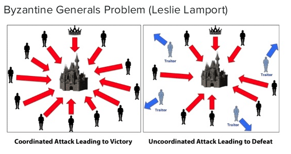
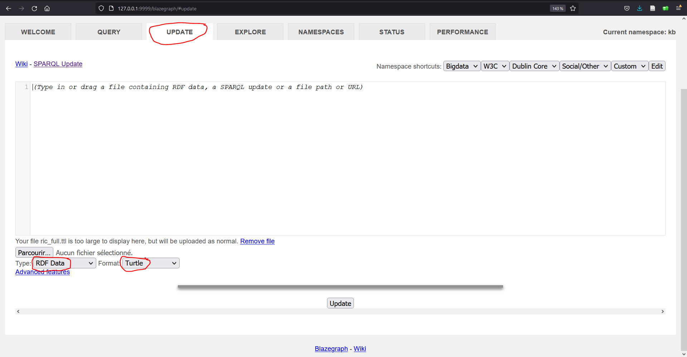

# Mise en oeuvre

---

Conetenu de cette session:

1. Valorisation et Indexation  
2. Plateforme LDP: documentation de Fedora Commons
3. Recherche : indexation et triple store
4. Et pour finir ...

---

# 1. Valorastion et indexation

---

### Rappel 

[Animation d'intégration](./media/integration.pptx)

---

### Besoin de "scalability"

En français, on pourrait dire d'"évolutivié". Il y a une dimention d'échelle.

En pratique, considérons les concepts suivants:

* Messaging
* Conteneurs 
* Fault-tolerence

---

### Messaging

Dans les application modernes, on utilise souvent le concept de ***messaging***.

Par exemple, la technologie [Apache Caml](https://camel.apache.org/) dont [Apache Kafka](https://www.youtube.com/watch?v=PzPXRmVHMxI).

---

### Conteneurs

Dans les application modernes, on utilise souvent le concept de ***conteneurs***, une façon de déployer des applications encore plus efficiente que la virtualisation.

Par exemple, la technologie [docker](https://www.youtube.com/watch?v=8cH0ilGlQdE), voir aussi cette [video](https://www.youtube.com/watch?v=0HjPvbGSdoo).

De plus, des systèmes d'orchestration permettent d'orchester les containers, p.ex. [kubernetes](https://www.youtube.com/watch?v=PziYflu8cB8).

---

### Fault tolerence

Éviter la corruption: le problème des Généraus Bizantins.



Il est démontré que pour tolérer f fautes, 3f+1 noeuds sont nécessaires. Cf. travaux de Lesslie Lamport fin des années 1970.

---

Ressources pour approfondir:

* [introduction](https://www.youtube.com/watch?v=LoGx_ldRBU0)
* [introduction visuelle](https://www.youtube.com/watch?v=A-mNgqJETQg)
* [lien avec la blockchain](https://www.youtube.com/watch?v=0lkhrobRTdo)
* [proof of work](https://www.youtube.com/watch?v=3EUAcxhuoU4&t=69s)
* [proof of work vs. proof of stake](https://www.youtube.com/watch?v=M3EFi_POhps)
* [AcademicOnFlux](https://www.hesge.ch/heg/actualites/2022/academiconflux-nouveau-projet-recherche-du-prof-arnaud-gaudinat)

---

### Résumé

* Messaging : optimiser le transfert de données entre les composants du système d'archivage
* Conteneurs : optimiser la charge des dans les datacenter et la protabilité (dépendances)
* Fault-tolerence : garantir la cohérence des données (prévention priratage et intégrité des données)

Fedora Commons est construit sut la base de ces techonologies.

---

# 2. Plateforme LDP: documentation de Fedora Commons

---

[Lyrasis - Fedora Commons - Documentation](https://wiki.lyrasis.org/display/FEDORA6x/Fedora+6.x+Documentation)

* Architecture
* [Installation](https://wiki.lyrasis.org/display/FEDORA6x/Quick+Start) (one click , docker)
* [Configuration](https://wiki.lyrasis.org/display/FEDORA6x/Configuration)(paramètres)
  * [configuration docker](https://github.com/fcrepo-exts/fcrepo-docker/blob/main/README.md) (users, praramètres:fcrepo.properties)
  * [liste des paramètres](https://wiki.lyrasis.org/display/FEDORA6x/Properties)
    * exemples: fcrepo.external.content.allowed, fcrepo.autoversioning.enabled, fcrepo.metrics.enable

---

[Points](https://wiki.lyrasis.org/display/FEDORA6x/Configuration) à ne pas ratter:

* Messaging
* External Search
* Metrics
* Auto-versionning
* Namespaces

---

3. Recherche : indexation et triple store

---

### Recherche : Indexation 

Exemples de moteurs de recherche: Solr, ElasticSearch ([introduction]https://www.youtube.com/watch?v=yZJfsUOHJjg). 

Des règles pour l'indexation via le messaging doivent être définies. 

Cf. [configuration de Solr avec Fedora](https://wiki.lyrasis.org/display/FEDORA6x/Solr+Indexing+Quick+Guide).

---

### Rechreche : Triple store

Nombreux outils disponibles, voir:
* [comparison of triplestores](https://en.wikipedia.org/wiki/Comparison_of_triplestores) et
* [large triplestores](https://www.w3.org/wiki/LargeTripleStores).

---

### Exemple d'usage avec Blazegraph

[blazegraph](https://blazegraph.com/)

Upload de turtle manuel également possible:


---

Quels prédicats RiC ont été utilisés?

```
PREFIX rico: <https://www.ica.org/standards/RiC/ontology#>
PREFIX rdf: <http://www.w3.org/1999/02/22-rdf-syntax-ns#>
PREFIX rdfs: <http://www.w3.org/2000/01/rdf-schema#>
SELECT DISTINCT ?pred WHERE {
  ?sub ?pred ?obj .
  FILTER(regex(str(?pred), "RiC" ) )
} 
LIMIT 100
```

---


Lister les intitulés de tous les records.

```
PREFIX rico: <https://www.ica.org/standards/RiC/RiC-O_v0-2.html#>
PREFIX rdf: <http://www.w3.org/1999/02/22-rdf-syntax-ns#>
PREFIX rdfs: <http://www.w3.org/2000/01/rdf-schema#>
SELECT DISTINCT * WHERE {
  ?sub rico:title ?obj 
} 
LIMIT 100
```

---


Qui est le parent de *object:001228-4-PP060-A-01-04* ?

```
PREFIX object: <http://localhost:8080/rest/object/>
PREFIX rico: <https://www.ica.org/standards/RiC/RiC-O_v0-2.html#>
PREFIX rdf: <http://www.w3.org/1999/02/22-rdf-syntax-ns#>
PREFIX rdfs: <http://www.w3.org/2000/01/rdf-schema#>
SELECT DISTINCT * WHERE {
  object:001228-4-PP060-A-01-04 rico:isOrWasPartOf ?obj .  
} 
LIMIT 100
```

---

Qui sont les parents (récursifs) de *object:001228-4-PP060-A-01-04* ?

```
PREFIX object: <http://localhost:8080/rest/object/>
PREFIX rico: <https://www.ica.org/standards/RiC/RiC-O_v0-2.html#>
PREFIX rdf: <http://www.w3.org/1999/02/22-rdf-syntax-ns#>
PREFIX rdfs: <http://www.w3.org/2000/01/rdf-schema#>
SELECT DISTINCT * WHERE {
  object:001228-4-PP060-A-01-04 rico:isOrWasPartOf* ?obj .  
} 
LIMIT 100
```

---

Qui sont tous les enfants (récursifs) de *object:001228-4-PP060* ?

```
PREFIX object: <http://localhost:8080/rest/object/>
PREFIX rico: <https://www.ica.org/standards/RiC/RiC-O_v0-2.html#>
PREFIX rdf: <http://www.w3.org/1999/02/22-rdf-syntax-ns#>
PREFIX rdfs: <http://www.w3.org/2000/01/rdf-schema#>
SELECT DISTINCT * WHERE {
  object:001228-4-PP060 ^rico:isOrWasPartOf* ?obj .  
} 
LIMIT 100
```

---

Quels sont les records dont les intitilés:

* coniennent "hôtel", "hotel", "Hôtel", or "Hotel"

```
PREFIX rico: <https://www.ica.org/standards/RiC/RiC-O_v0-2.html#>
PREFIX rdf: <http://www.w3.org/1999/02/22-rdf-syntax-ns#>
PREFIX rdfs: <http://www.w3.org/2000/01/rdf-schema#>
SELECT DISTINCT * WHERE {
  ?sub rico:title ?obj .
  FILTER(regex(str(?obj), ".*[Hh][oô]tel.*" ) )
} 
LIMIT 100
```

---

Quels sont les records dont les intitilés:

* coniennent "hôtel", "hotel", "Hôtel", or "Hotel"
* et datant des années 1930 ou 1940

```
PREFIX rico: <https://www.ica.org/standards/RiC/RiC-O_v0-2.html#>
PREFIX rdf: <http://www.w3.org/1999/02/22-rdf-syntax-ns#>
PREFIX rdfs: <http://www.w3.org/2000/01/rdf-schema#>
SELECT DISTINCT * WHERE {
  ?record rico:title ?title .
  ?record rico:isAssociatedWithDate/rico:expressedDate ?date .
  FILTER(regex(str(?title), ".*[Hh][oô]tel.*" )) .
  FILTER(regex(str(?date) , ".*19[34]\\d*"     )) .
} 
LIMIT 100
```

---

4. Et pour finir ...

---

### Réalisations suisses utilisant les conceptpe à ce cours

* [Bodmer Lab, UNIGE](https://bodmerlab.unige.ch/fr) : FedoraCommons + ElasticSearch + InterfaceAdHoc
* [memobase.ch](https://memobase.ch) : FedoraCommons + ElasticSearch + InterfaceAdHoc
* [docuteam cosmos](https://www.docuteam.ch/fr/docuteam-cosmos/) : FedoraCommons + Solr + AtoM / InterfaceAdHoc. Exemples:
  * [SIAr neuchâtelois](https://www.siar.ch/?page_id=429)
  * [société des Arts genevoise](https://archives.societedesarts.ch/archives/)
  * [Registre Foncier valaisan](https://archivesonline.vs.ch/index.php/informationobject/browse)
  * ...

---

### Idées de TB

De nombreuses instances AtoM existent en Suisse

* [vaud.archivescommunales.ch](https://vaud.archivescommunales.ch/repository/browse)
* [ge.archivescommunales.ch](https://ge.archivescommunales.ch/repository/browse)
* [caspar.cinematheque.ch](https://caspar.cinematheque.ch/informationobject/browse)
* [architrave-hesge.ch](https://www.architrave-hesge.ch/informationobject/browse)
* [arCHeco.info](https://www.archeco.info/)
* [Registre Foncier valaisan](https://archivesonline.vs.ch/index.php/informationobject/browse)
* [f-information.org](http://archivesfiligrane.f-information.org/index.php/informationobject/browse)
* [CIRA.ch](https://www.cira.ch/archives/)
* ...

De plus, les archives de Bâle-Ville, PTT et Memoriav sont déjà disponibles au format RiC.

---

Sujet possible (variante à préciser/discuter):

* Intégration d'inventaires archivistiques dans le projet connectome
* Valorisation des archives sur Wikidata
* Diffusion d'inventaires archivistiques sur le Web sémantique
* Publication de la plateforme AtoM vers le Web sémantique
* etc.

Intéressé.e? => jan.krause@vd.ch

---

### Évolution de ce cours

=> Évaluation du cours en ligne sur le portail AGE. 

---


  

  


